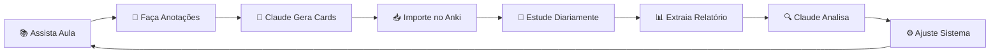

# 🎯 Anki Master Guide
*O caminho mais direto para dominar o Anki*

## 📖 O que é este guia?

Um sistema progressivo e prático para dominar o Anki Desktop em português, integrado com Claude para máxima eficiência no aprendizado.

## 🎯 Filosofia

### Por que este guia é diferente?
- **Enxuto**: Sem informações desnecessárias
- **Progressivo**: 3 níveis claros de evolução
- **Prático**: Configurações exatas e testadas
- **Integrado**: Use Claude para criar cards e analisar progresso

## 📊 Jornada de 3 Níveis

### 🟢 [Nível 1: Iniciante](./nivel-1-iniciante/) (0-2 meses)
**Meta**: Criar o hábito diário
- Configuração básica que funciona
- Como criar bons cards com Claude
- Objetivo: 30 cards/dia consistente

### 🟡 [Nível 2: Intermediário](./nivel-2-intermediario/) (2-6 meses)
**Meta**: Otimizar e organizar
- Configurações por tipo de conteúdo
- Análise de progresso com relatórios
- Objetivo: Sistema eficiente e organizado

### 🔴 [Nível 3: Avançado](./nivel-3-avancado/) (6+ meses)
**Meta**: Dominar completamente
- Análise profunda e automação
- Configurações expert personalizadas
- Objetivo: Sistema otimizado ao máximo

## 🤖 Fluxo de Estudo com Claude



## 📁 Estrutura do Repositório

```
anki-master-guide/
├── 📗 nivel-1-iniciante/     # Comece aqui
├── 📙 nivel-2-intermediario/  # Evolua quando dominar o básico
├── 📕 nivel-3-avancado/       # Domine completamente
├── 🤖 prompts/                # Prompts para Claude
└── 📊 relatorios/             # Como extrair e analisar
```

## 🚀 Como Começar

1. **Iniciantes**: Vá direto para [Nível 1](./nivel-1-iniciante/)
2. **Já usa Anki**: Avalie seu nível e comece do apropriado
3. **Quer só os prompts**: Veja a pasta [prompts](./prompts/)

## ⚡ Início Rápido (5 minutos)

1. Baixe o [Anki Desktop](https://apps.ankiweb.net/)
2. Configure em português (Ferramentas > Preferências > Idioma)
3. Vá para [Nível 1](./nivel-1-iniciante/) e siga o guia
4. Use o [prompt de criação](./prompts/criacao-cards.md) com Claude

## 🎯 Resultados Esperados

- **Mês 1**: Hábito diário estabelecido
- **Mês 3**: Sistema organizado e eficiente
- **Mês 6**: Domínio completo da ferramenta
- **Mês 12**: Milhares de cards dominados

## 💡 Dica Principal

> "A consistência supera a perfeição. Melhor 10 cards por dia todos os dias do que 100 cards uma vez por semana."

---

**Pronto para começar?** → [Vá para o Nível 1](./nivel-1-iniciante/) 🚀
